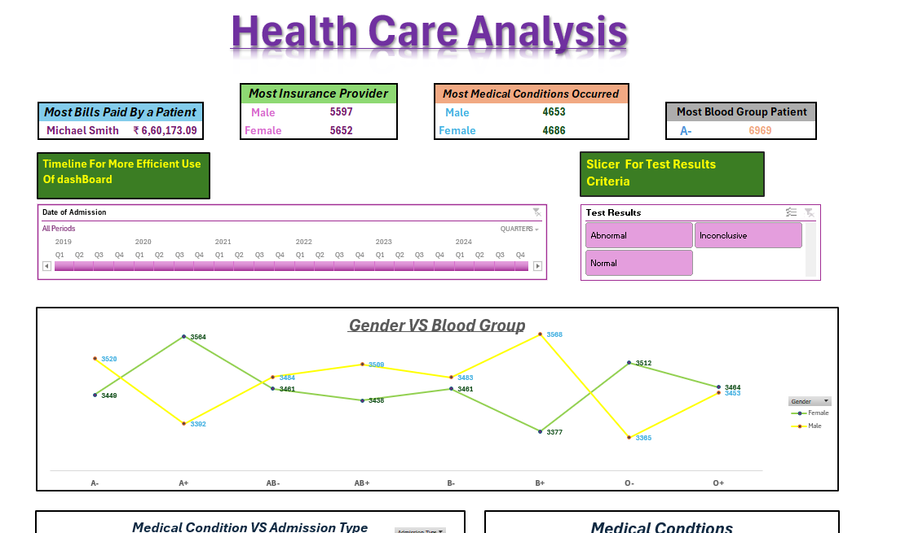

## 📸 Dashboard Preview

# 📊 Namya Shah - Healthcare Excel Dashboard

Welcome to my interactive Excel Dashboard project! This dashboard is designed to explore and analyze healthcare data in a visually intuitive way. From raw datasets to rich visualizations, every piece works together to help users extract meaningful insights 📈.

---

## 🚀 Features

✨ **Interactive Visuals**  
✔️ Slicers and filters for dynamic data exploration  
📊 Charts (Bar, Line, Pie) for instant visual feedback  
🔄 Real-time pivot table summaries

📂 **Well-Structured Workbook**  
📁 `DashBoard` – The main visual dashboard  
📁 `Healthcare_dataset` – Clean and organized raw data  
📁 `Pivot Tables` – Aggregated summaries for key metrics  
📁 `Operations And Functions` – Helper formulas and logic

---

## 🛠️ Built With

| Tool            | Purpose                                      |
|-----------------|----------------------------------------------|
| 💻 Microsoft Excel | Dashboard creation, Pivot Tables, Charts   |
| 📐 Excel Formulas | Data cleaning and dynamic calculations     |
| 🎯 Slicers        | Interactive data filtering                  |

---

## 📈 Use Case

This project dives into a **healthcare dataset** to highlight insights around patient trends, treatments, and operational metrics. It’s great for healthcare analysts, students, or managers who want a fast, visual way to understand large amounts of data.

---

## ✅ How to Use

1. Download the `.xlsx` file from this repo.
2. Open it in **Microsoft Excel**.
3. Head to the `DashBoard` tab.
4. Use slicers to interactively filter and explore the data.
5. Review the `Pivot Tables` and `Operations And Functions` for back-end logic.

---

## 💡 Future Improvements

- Automate data import from external sources
- Add forecasting tools using trendlines
- Migrate to Power BI for more robust interaction

---

## 🙋‍♀️ About Me

👩‍💻 Created by **Namya Shah**  
📬 *Feel free to reach out with questions or ideas!*  
🌐 [Namyashah]

---

## 📁 Download

> You can find the Excel file in this repo:  
> **`https://github.com/Namyashah/Namyashah-FinalProject_Practical_Excel.git`**

---
